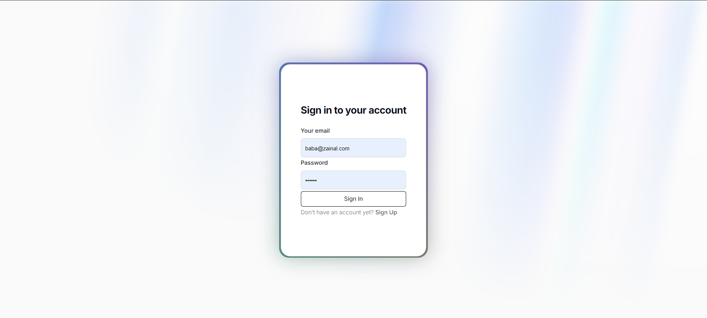
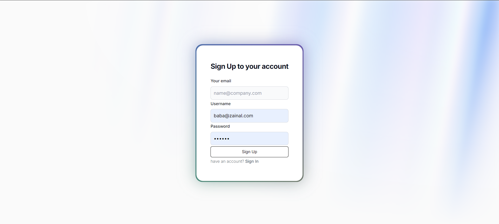

Run this project

1. clone
   ```
   git clone https://github.com/zaenalarifin12/next-js-kuleb
   ```
2. install
    ```
   cd next-js-kuleb && npm install 
   ```
3. run
   ```
   npm run dev
   ```





